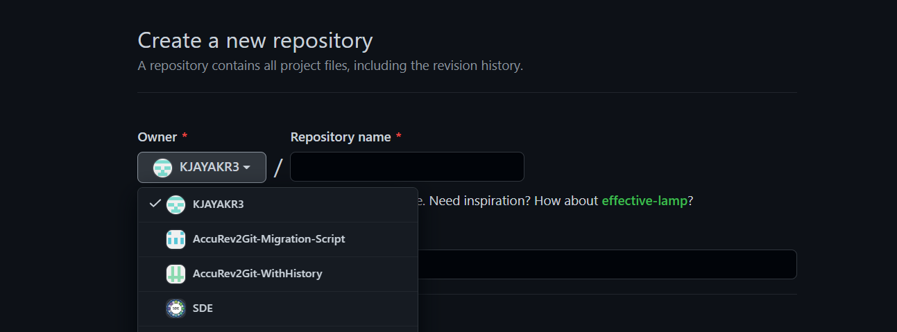
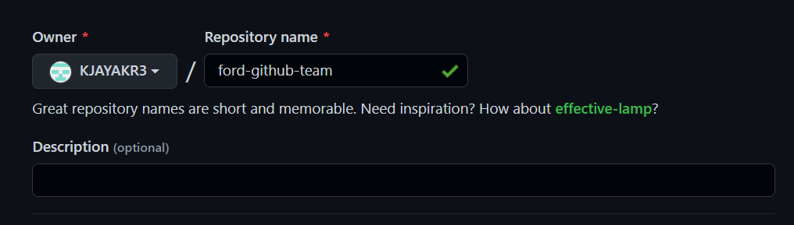
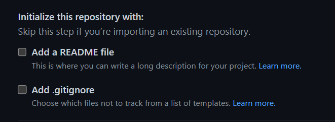

# Repository

All the files of your project are maintained in a repository, together with a history of all file changes. Within the repository, you can manage and discuss the work about your project. You can either individually own repositories or collaboratively own repositories with other organization members. It allows remote collaboration on projects between you and other individuals.

## Repository Visibility

By specifying the visibility of a repository, you can restrict who can access it:
 *public or private or internal*

* **Public** repositories are accessible to everyone on the internet.
* **Private** repositories are only accessible to you, people you specifically provide access to as well as specific organization members in the case of repository access.
* **Internal** repositories are accessible to Ford Motor Company enterprise members.

## Setting up a New Repository

You can create a new repository on any organization where you have sufficient permissions.
> Note: **Internal Repository option is available if your Organization is part of Ford Motor Company.**

1. Use the drop-down menu in the top-right corner of any page to select New repository.
    

2. Then choose account you need to use to create the repository from Owner drop-down menu.
    

3. Provide your repository a name and an appropriate description.
    

4. Select on the repository visibility. See the section labeled above **"About Repository Visibility"** for more information.
    

5. Initialize the repository with the optional choices as below:
    * Add a **README file**
        > **A README file, which is a document describing your project.**
    * Add **.gitignore**
        > **You can create a .gitignore file, which is a set of ignore rules.**
        
    

6. Then click **Create Repository**.
