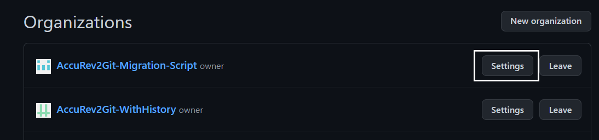
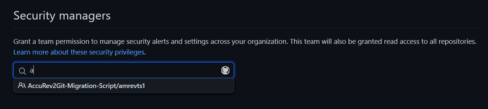

# Teams and Roles

## Teams

Teams are collections of members that reflect the organizational structure of a business or group and have cascade access privileges and references. Teams can be granted admin, read, or write access to organization repositories by organization owners and team maintainers.

## Organization members

* By mentioning the team's name, organization members can notify the entire team at once.
* Members of the organization who have read access to the repository where the pull request is opened may request specific teams for reviews.
* By requesting for a review from a team, organization members can also notify that team as a whole.

## Team maintainer

The team maintainer role allows its members to control the configurations and membership of a team.

<ins>**Advantages:**</ins>

* Add a new team name and description.
* Requesting to modify or add a parent/child team
* Add/Remove team members from the organisation
* Specify the team's display picture.
* Team's exposure
* Adding/removing the team's repository access
* Edit and remove group discussions

## Security manager

Organization owners can nominate any team inside their company with the function of security manager, which is an organizational level position. Once configured, it grants each team member read access to all organization-wide repository locations as well as permission to handle security alerts and settings.

<ins>**Permissions for the security manager role:**</ins>

Security manager team members are limited to the permissions necessary to manage security for the organization.

* In addition to any repository access already in place, read access to all repositories inside the organization.
* The capability of setting security parameters at the organizational level
* Write access on all security alerts in the organization
* Having security settings configurable at the repository level

### <ins>Assigning the security manager role to a team in your organization</ins>

> Note: **You can assign the security manager role to a maximum of 10 teams in your organization**

1. Click your profile picture, then click Your organizations, at the top right corner of Ford GitHub.

    

2. Select Settings next to the organization.

    

3. Choose "Code security and analysis" under "Security" on the sidebar.

4. Identify and choose the team you want to assign the role to under Security managers. The teams you choose will show up in a list under the search bar.

    

