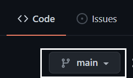
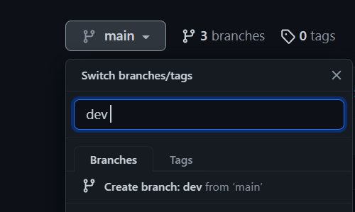

# Branches

Branches allow you to develop features, resolve bugs, or securely experiment with new ideas in a limited portion of your repository. To separate development work from other branches in the repository, use a branch. Every repository comes with a default branch and the option of having additional branches. Using a pull request, you can combine one branch into another.

By default, GitHub names the default branch **main** in any new repository.

## Creating a branch

1. Navigate to the repository's main page on Ford GitHub

2. If you'd like to create the new branch from a branch other than the repository's default branch, you can click **Branches** and select a different branch.

    

3. Select the branch selector.

    

4. Provide a unique name to your new branch, then select Create branch.

    

::: tip Additonal Information

 To know more about Git branching strategies, Click [here](../ch04/13-git-branch-strategy.md)

:::