# Request GitHub access

## For Ford Users
The below mentioned instructions are only for *Ford CDSIDs*.

Access requests are managed through IT’s **Application Policy Services (APS)** application. The request workflow is performed on the following website. [Access Management](https://www.accessmgmt.ford.com/CspsWeb/cspsHomeBegin.do)

Use this Wiki FAQ for information about who can request access and request access to GitHub - [Who can request a GitHub license](https://wiki.ford.com/display/SDE/Who+can+request+a+GitHub+license)

**Note: For CDSIDs with Employment Types: E, G, & O an LL6+ must submit the APS request. These Employment Types are typically used for proxy ids.**

1. Open a browser and navigate to [Access Management](https://www.accessmgmt.ford.com/)

2. Click the green *'Go'* button next to your name.

3. On the next page enter **“GitHub”** into the search box. "All Application Domains" will be displayed in the drop-down to the left of the search box, click Search.

    * **Note:** If the user already has access to GitHub, there will be a Status field indicating that

    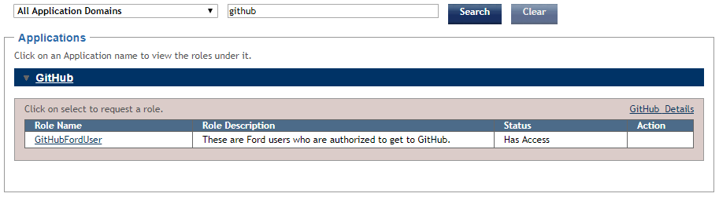 

4. This should show the GitHub application in the Applications section towards the bottom of the screen, click the arrow to the left of the word GitHub to expand the list of roles.

5. Scroll down and find the *“GitHubFordUser”* role and click on Request Access (Green button on the right side of the screen).

6. Enter a *“Note to Approvers”* if applicable (i.e. the Skill Team you are requesting access for) and click the “Submit Request” (Green button).

7. That will initiate the approval chain process for getting access to Production GitHub. Once your access is approved you can use your Ford credentials to login to the production instance at [GitHub](https://github.ford.com)

 > **NOTE:** After access is approved - The CDSID must successfully log into GitHub once to consume a license. This will instantiate the CDSID and make it available in GitHub so that it can be added to a repository/team/etc.

## For Covisint Users

THE DOCUMENT BELOW PROVIDES INSTRUCTIONS FOR FORD SUPPLIER PORTAL (FSP) USERS AND COVERS:

*	**HOW TO REQUEST FSP APPLICATIONS USING ADMINISTRATION TOOLS.**
*   **HOW TO REQUEST FSP APPLICATIONS USING THE ‘REQUEST’ ICON ON THE FSP ‘APPLICATIONS’ TAB.**

Some applications are automatically granted to you when you get FSP access.  However, some FSP applications must be granted to you by your organization’s Covisint Corporate Security Administrator (CSA). If you need to let your organization’s CSA know that you need additional FSP applications that are not already part of your FSP access please follow the instructions provided below.

#### <ins>HOW TO REQUEST FSP APPLICATIONS USING ADMINISTRATION TOOLS</ins>

1. From the Covisint or FSP Home pages select **‘Administration Tools’**

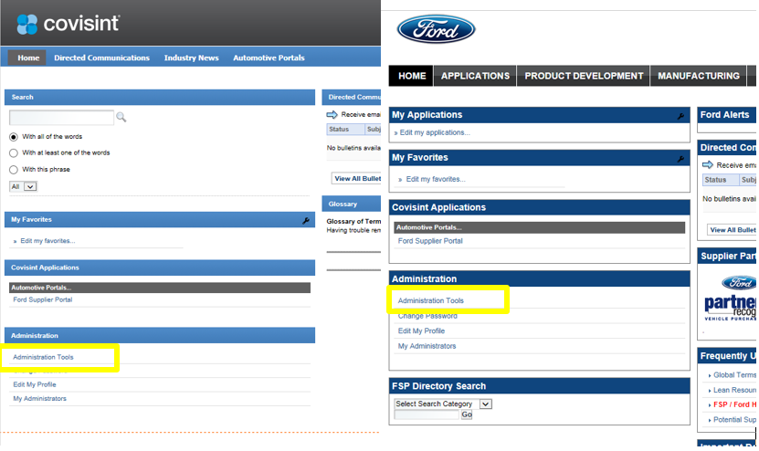

2. On the Covisint Connection and Administration (Administration Tools) page, select **‘Request a service package’**

3. On the ‘request service package: (user name) screen, scroll down to the ‘Ford Supplier Portal’ if you have FSP access a ‘request sub-package (application package) will display.

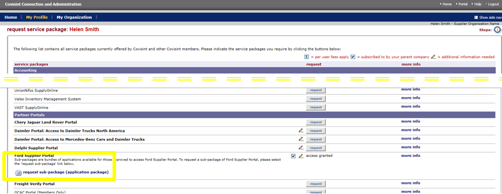

4. On the ‘request service package: request sub-package of Ford Supplier Portal for (username) screen select the service package(s) you require by putting a checkmark to the left of the application name.  
> **Note:** Multiple applications can be selected at one time

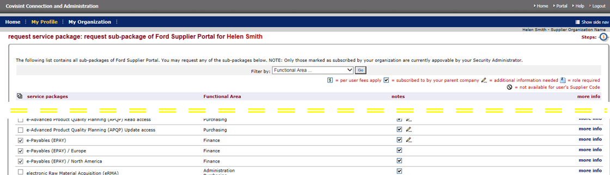

5.  After selecting the applications scroll down to the bottom of the page, enter a request reason if need (not required) and then click on *‘continue’*

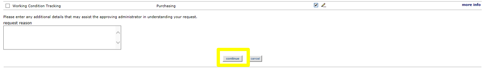

6. The ‘request service package: (first application name selected) for (username)>select site code(s) will display allowing you to pick any GSDB code that is available to your organization. The selected codes will determine what access you will be enabled for in the application.  Once the code(s) are selected click on ‘continue’.

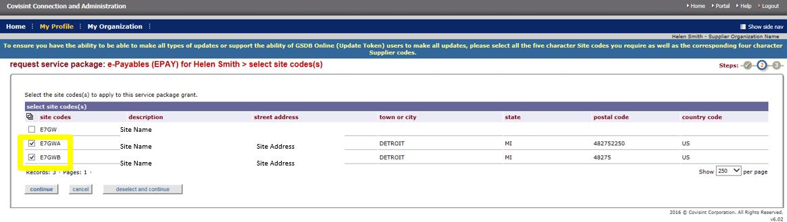

7. The "request service package: request sub-packages of Ford Supplier Portal for (user name)> Request Successful!" page will display.

8. The request for the application is complete. A notification has been sent to your company’s Covisint CSA and your request is pending their approval.

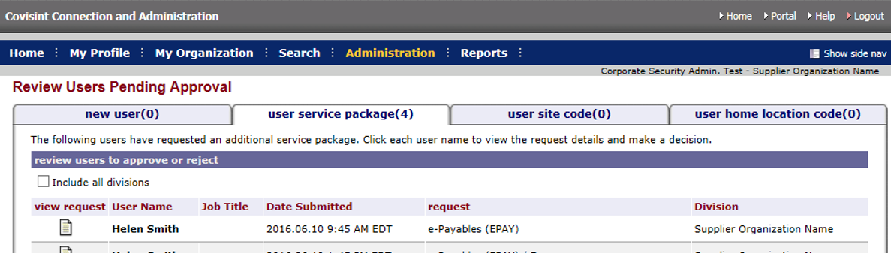

#### <ins>HOW TO REQUEST FSP APPLICATIONS USING THE ‘REQUEST’ ICON ON THE FSP ‘APPLICATIONS’ TAB</ins>

Another way to request FSP applications is using the ‘request’ link on the FSP ‘Application’ tab.

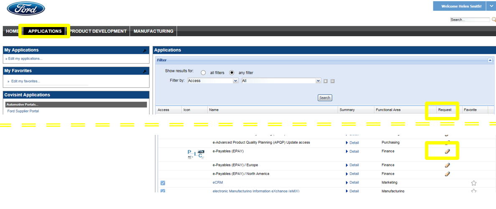

1.  On the FSP ‘Applications’ page click on the ‘Request’ icon next to the application you want added. 

> **Note:**  The ‘Request’ icon will only display for application you do not have access to

2. The following message will display:

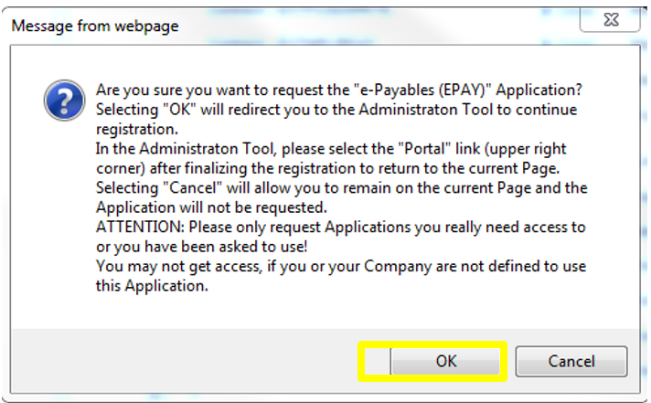

* Note the instructions and click ‘OK’

3. The ‘request service package: request sub-package of the Ford Supplier Portal for (username)’ page will display. Scroll down until you find the application you want to request.  This method will only let you request one application at a time.

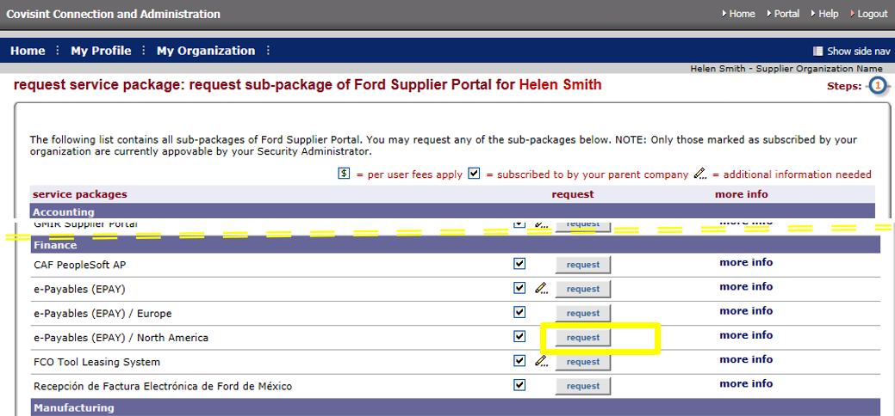

4.  The "request service package: (selected application name) for (username)> review package details" page will display.  Click *‘Continue’*

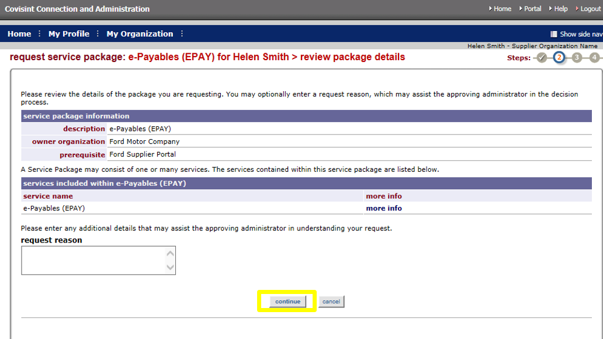

5.  The request service package: (selected application name) for (username)> select site code(s) screen will display.  Select the GSDB codes that you will need to view data for in the selected application. 

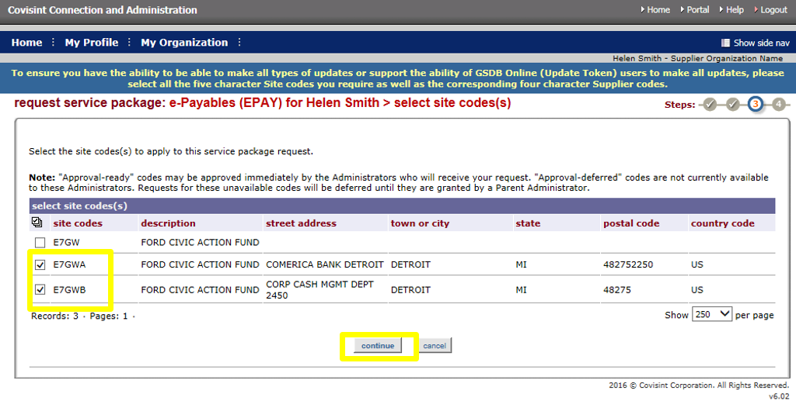

6.  The "request service package: (selected application name) for (username)> Request Successful!" screen will display.

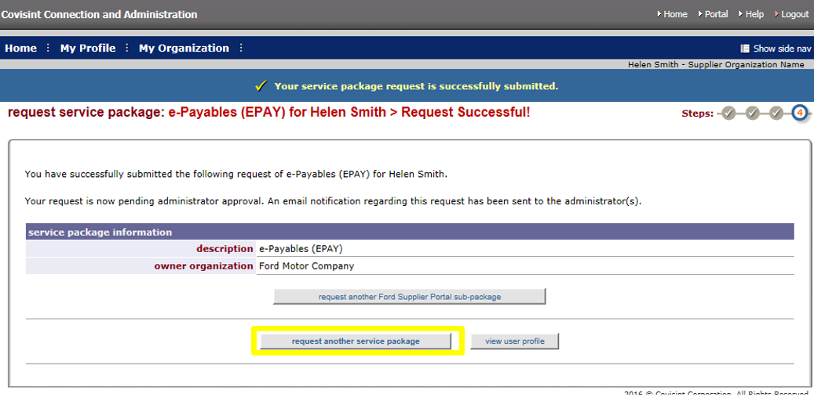

7. The request for the application is complete. A notification has been sent to your company’s Covisint CSA and your request is pending their approval.

8. If you need to request another application, click on the ‘request another service package’ button and repeat the process.

