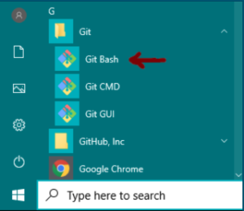

# Create a SSH Key

1. Open a bash shell (i.e. git bash). To do this, click your Start menu, then find the Git folder, then **"Git Bash"** in it. This will open up the git bash prompt.

    

    > **Note:** To paste commands in the git bash prompt, either middle-click your mouse, or press SHIFT+INSERT.  Pressing CTRL+V will not work.

2. Type this command at the prompt.
    ```bash
    mkdir ~/.ssh
    ```

3. Create an ssh key pair by typing this command

    ```bash
    ssh-keygen -t rsa -N '' -f ~/.ssh/id_rsa
    ```

    > **Your screen will look like this**
      

4. Copy the value in the **~/.ssh/id_rsa.pub** file. You can run this command to copy it.

     ```bash
     cat ~/.ssh/id_rsa.pub  | clip
     ```

5. Visit [Ford GitHub](https://github.ford.com), click the your avatar at the top-right of the page. Then, click "settings" in the popup menu, click "SSH and GPG keys", select "New SSH key"

6. Paste the value of your SSH key, and a descriptive title, and click "Add SSH Key"