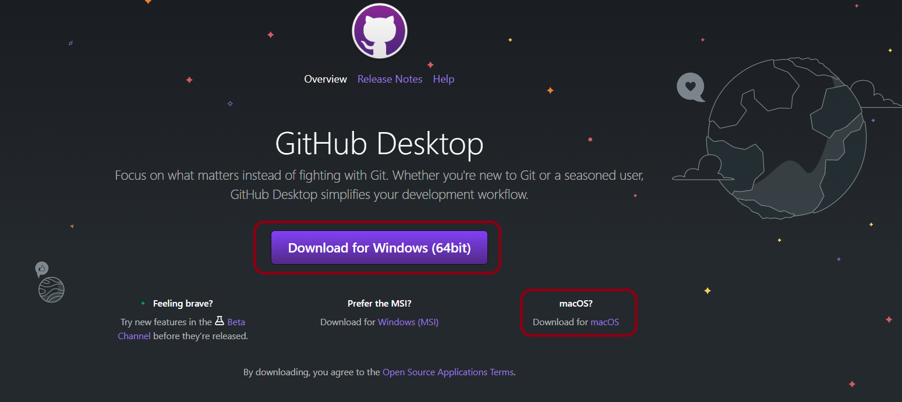

# GitHub Desktop

GitHub Desktop, you can interact with GitHub using a GUI instead of the command line or a web browser. You can use GitHub Desktop to complete most Git commands from your desktop, such as pushing to, pulling from, and cloning remote repositories, attributing commits, and creating pull requests, with visual confirmation of changes.

### <ins>About GitHub Desktop installation</ins>

You can install GitHub Desktop on supported operating systems, which currently include macOS 10.12 or later and Windows 7 64-bit or later. If you have an account on GitHub or GitHub Enterprise, you can connect your account to GitHub Desktop. For more information about creating an account, refer *Requesting GitHub access* page in this user guide.

<ins>**Downloading and installing GitHub Desktop**</ins>

1. Visit the download page for [GitHub Desktop](https://desktop.github.com/)

2. Click Download either for *macOS or Windows* depends on your OS.

3. In your computer's **Downloads** folder, double-click the **GitHub Desktop** zip file.

4. After the file has been unzipped, double-click GitHub Desktop.

5. GitHub Desktop will launch after installation is complete.

::: tip Few links related to GitHub Desktop.
* [Creating your new repository using GitHub Desktop](https://docs.github.com/en/desktop/installing-and-configuring-github-desktop/overview/creating-your-first-repository-using-github-desktop)
* [Keyboard shortcuts in GitHub Desktop](https://docs.github.com/en/desktop/installing-and-configuring-github-desktop/overview/keyboard-shortcuts)
* [Launch GitHub Desktop from the command line](https://docs.github.com/en/desktop/installing-and-configuring-github-desktop/overview/launching-github-desktop-from-the-command-line)
:::

