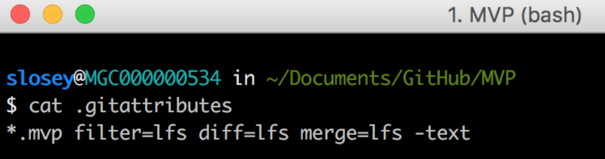

# Setup Git & Git-LFS

<ins>**Installing the Git Clients**</ins>

**Note:** Administration level privileges are **NOT** required to install Git & Git-LFS.

1. Download the latest approved version [7012742](https://www.eams.ford.com/technology/viewTechnology.faces?endWorkflowURL=%2Ftechnology%2FsearchTechnologyResults.faces%3Ffaces-redirect%3Dtrue&dswid=5300&jc-begin-workflow=true&selectedTechnologyId=7012742&viewRowIndex=0) of Git from [URL](https://github.com/git-for-windows/git/releases)

* Open a Git Bash shell to verify the Git installation.
```bash
$ git --version
git version 2.2
```
2. After installing Git, download the latest approved version [7012812](https://www.eams.ford.com/technology/viewTechnology.faces?endWorkflowURL=%2Ftechnology%2FsearchTechnologyResults.faces%3Ffaces-redirect%3Dtrue&dswid=5300&jc-begin-workflow=true&selectedTechnologyId=7012812&viewRowIndex=0) of Git-LFS from [URL](https://git-lfs.github.com)

* Open a Windows CMD Prompt to verify the Git-LFS installation.
```
C:\Users\sdemail> git-lfs version
git-lfs/2.8.0
```

### <ins>Leveraging Git-LFS</ins>

**`Note:`** Proceed with this section, if you plan on leveraging Git-LFS from Nexus

<ins>**Nexus Prerequisite**</ins>
 
 * Submit a Request Center ticket for a Nexus LFS Repository. Instructions are located here- [Request a Repository](https://azureford.sharepoint.com/sites/SDE/SitePages/Nexus/nexus-request-a-repo.aspx)

1.  Open Git Bash and install git-LFS plugin - **`git lfs install`**

2. Navigate to the repository you would like to use Git LFS with

    A) To track large files, use the **`git lfs track`** command
* The git lfs track command stores the tracked file patterns in the .gitattributes hidden file within the repository directory on your workstation.

* Files previously committed (before Git LFS was installed) will not be impacted by the above command (only new files will).
* To see a list of all patterns currently being tracked by Git LFS, run **git lfs track** with no arguments.
* To see a list of all files being tracked by Git LFS, run the **git lfs ls-files** command.
* To track additional files re-run the **git lfs track '*.new'**  command (Single quotes must be included. The `*.new` is an example).
* To 'untrack' files run the command **git lfs untrack '*.new'**  (Single quotes must be included. The `*.new` is an example).
* Command example:`git lfs track '*.mvp'` (Single quotes must be included)

<ins>**IMAGE - Git LFS Track Example:**</ins>


  B) Add *(git add / git commit / git push) .gitattributes* to the GitHub repository.

1. Command: `git add .gitattributes`

2. Command: `git commit -m "adding .gitattributes"`

3. Command: `git push`

4. **Note:** The .gitattribute file is located at the root of the repository directory.

5. **Note:** When the repository is cloned the .gitattributes file will be cloned down to the workstation

<ins>**IMAGE - Create .lfsconfig setup:**</ins>





C) Configure the 'endpoint' (Nexus) where the large files will be stored.

D) In Git Bash execute the following:

1. Command: git config -f .lfsconfig lfs.url *http://www.nexus.ford.com/repository/repo_name/info/lfs*

2. **Note:** you may need to log into Nexus at https://www.nexus.ford.com to check your full repository name.  E.g. "MYREPO_private_lfs_repository"

3. **Note:** It is required to have '/info/lfs' at the end of the endpoint (url above).

<ins>**IMAGE - Create .lfsconfig setup:**</ins>

    

    * If you receive a "file locking" message (see below) when "pushing" files to your GitHub repo you will need to set file locking.  More information about LFS File Locking can be found here- https://github.com/git-lfs/git-lfs/wiki/File-Locking

    **Message referenced above:**
        
        1. Remote "origin" does not support the LFS locking API. Consider disabling it with:

        2. $ git config 'lfs.http://www.nexus.ford.com/repo_name/info/lfs.locksverify' false

        3. Git LFS: (0 of 0 files, 7 skipped) 0 B / 0 B, 879.11 KB skipped

   * **Command:** git config 'lfs.http://www.nexus.ford.com/repository/repo_name/info/lfs.locksverify' false
   * **Command:** git config 'lfs.http://www.nexus.ford.com/repository/repo_name/info/lfs.locksverify' true

   3. From this point forward, any file that matches the criteria/patterns contained within *.gitattributes* will be stored in Nexus, and a 'pointer' to the file will be stored in GitHub.

        1. Create a test file (i.e. sde.mvp) and add the file to GitHub.
        2. Command: **`git add sde.mvp`**
        3. Command: **`git commit -m "adding LFS file sde.mvp"`**
        4. Command: **`git push`**

<ins>**IMAGE - Adding files to Nexus and links to GitHub:**</ins>


<ins>**Notes:**</ins>

1. *Only http:// and https:// endpoints are supported by the git-lfs client. There is currently no direct ssh:// or file://.*

2. *If you receive a HTTP 503 error during the "git push" command, verify that you have the correct proxy settings (below) in your '.profile' or '.bash_profile'.*

* export https_proxy="http://internet.ford.com:83"
* export http_proxy="http://internet.ford.com:83"
* export no_proxy="localhost, 127.0.0.1, .ford.com, 19.0.0.0/8, 10.0.0.0/8, 172.16.0.0/12, 192.168.0.0/16"

::: tip Additional Resources:
* [Git LFS Tutorial](ttps://github.com/git-lfs/git-lfs/wiki/Tutorial)

* [Configuring Git Large File Storage](https://help.github.com/articles/configuring-git-large-file-storage/)

* [Nexus Repository Manager](https://books.sonatype.com/nexus-book/reference3/gitlfs.html)

:::


