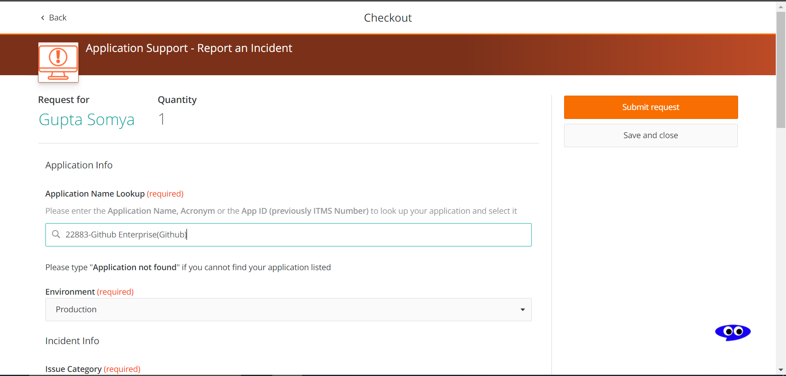

# Submit a GitHub Incident

### Steps
* Navigate to [Application Support - Report an Incidnet](https://ford-dwp.onbmc.com/dwp/app/#/itemprofile/1109).
* Click on *Request Now*. 
* Under Application Lookup, type *GitHub* and select the ***22883-Github Enterprise(Github)*** which appears.
* After selecting the appropriate request options and filling the Request Descrption, click on *Submit Request* button. 

