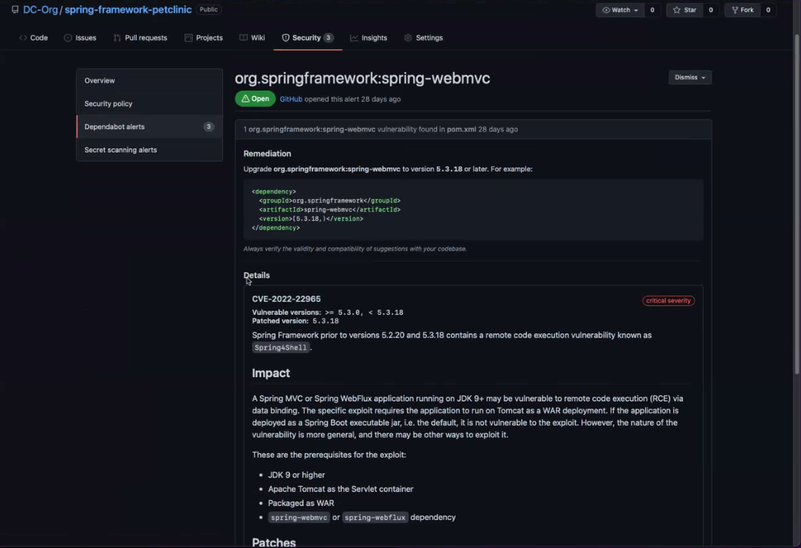

# Dependabot

## Using Dependabot
#### Features available:
* [Keeping your supply chain secure with Dependabot - GitHub Docs v3.4](https://docs.github.com/en/enterprise-server@3.4/code-security/dependabot)
    * [Automatically updating dependencies with known vulnerabilities with Dependabot security updates - GitHub Docs v3.4](https://docs.github.com/en/enterprise-server@3.4/code-security/dependabot/dependabot-security-updates)
    * [Keeping your dependencies updated automatically with Dependabot version updates - GitHub Docs v3.4](https://docs.github.com/en/enterprise-server@3.4/code-security/dependabot/dependabot-version-updates)
    * [Working with Dependabot - GitHub Docs v3.4](https://docs.github.com/en/enterprise-server@3.4/code-security/dependabot/working-with-dependabot)

#### What it is...
Dependabot is tool that allows you to monitor vulnerabilities in dependencies used in a project and keep the dependencies up-to-date.

#### What it isn't...
Dependabot is not part of GitHub Advanced Security. It doesn't include features such as Secret scanning.
Dependabot does not make changes to your code without your intervention. 

#### What to expect...
#### Alert Notifications
Initially we will be enabling Dependabot without Notifications to allow teams time to perform corrective actions without receiving too many emails. 

#### Repository Banners
Repositories with vulnerable dependencies will see a banner similar to the one bellow which will direct you to view the Dependabot Alerts.

#### Dependabot Alerts
Dependabot Alerts can be found in the security tab of a repository. Dependabot Alerts are listed by their severity rating. From here you will be able to view suggested fixes, if available. You can then decide what corrective actions to take.

  

#### Making it work...
#### Dependency Graphing supported languages.
[About the dependency graph - GitHub Docs](https://docs.github.com/en/enterprise-server@3.2/code-security/supply-chain-security/understanding-your-software-supply-chain/about-the-dependency-graph#supported-package-ecosystems)
GitHub Dependency Graphing and Dependabot only support some programming languages/package managers. 

If you are using a supported language listed bellow you must have have one of the recommend or supported in your repository to receive Dependabot Alerts. 

| Package Manager | Languages | Recommended Formats | All supported formats |
| ---------------- | ----------- | ------------------------ | ---------------------------------- |
| Yarn | JavaScript | yarn.lock	| package.json, yarn.lock | 
| RubyGems | Ruby | Gemfile.lock | Gemfile.lock, Gemfile, *.gemspec | 
| pip | Python | requirements.txt, pipfile.lock	| requirements.txt, pipfile, pipfile.lock, setup.py[1] | 
| NuGet	| .NET languages (C#, F#, VB), C++ | .csproj, .vbproj, .nuspec, .vcxproj, .fsproj | .csproj, .vbproj, .nuspec, .vcxproj, .fsproj, packages.config | 
| npm | JavaScript | package-lock.json | package-lock.json, package.json | 
| Maven	| Java, Scala | pom.xml | pom.xml | 
| Go modules | Go | go.mod | go.mod | 
| Composer | PHP | composer.lock | composer.json, composer.lock | 