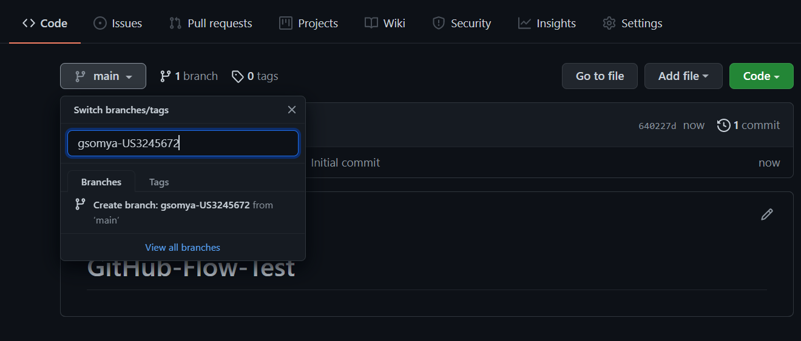
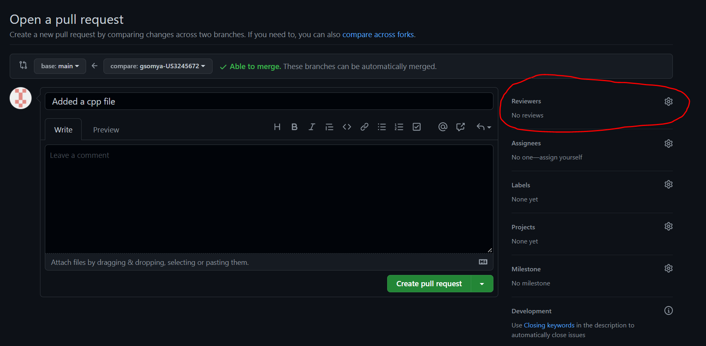
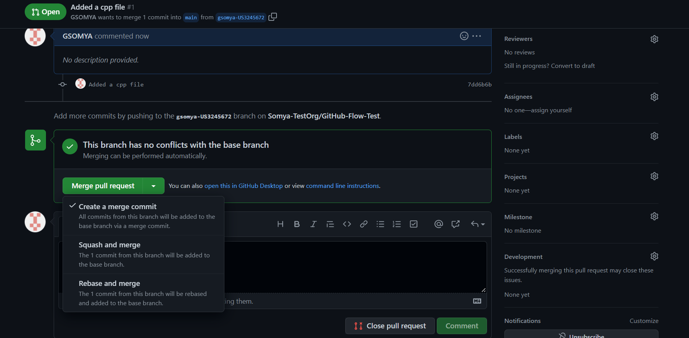

# Git Branching Strategies

There are two ways to manage projects in GIT, **Git flow** and **GitHub flow**. These two flows are used in managing a project and optimizing the workflow.

## Git Flow

Git flow is a Git branching strategy aimed at simplifying releases. This workflow involves the use of feature branches along with multiple primary branches. Gitflow is used for projects that have a scheduled release cycle.

Gitflow consists of five different branches:

#### Main Branch

The main branch consists of production-ready code which can be released. In Git flow, the main branch is created at the start of a project and is maintained throughout the development process. 

All the branches will be merged into the main branch after they have been tested.

#### Develop Branch

Similar to the main branch, the develop branch is created at the start of a project and is maintained throughout the development process, and contains pre-production code with newly developed features that are in the process of being tested.

#### Feature Branch

The feature branch is used to add new features to a project. The feature branch is taken from a develop branch and once the feature is completed, it is merged back to the develop branch.

#### Release Branch

The release branch is used for new production releases. Any changes in the release branch will be merged with both the main and develop branch.

#### Hotfix Branch

The hotfix branch is used to work on last-minute changes in the main branch. Once the changes are made, the hotfix branch will be merged with both the main and develop branch. 

### Step-by-Step approach to implement Git Flow

#### Creating main and develop branches

The first step is to create a develop branch from the main branch.

* Without the git-flow extensions:
```bash
$ git branch develop
$ git push -u origin develop
```

* Using git flow library
```bash
$ git flow init
```

#### Creating Feature branch

* Without the git-flow extensions:
```bash
$ git checkout develop
$ git checkout -b feature_branch
```
* Using git-flow extension:
```bash
$ git flow feature start feature_branch
```

#### Closing Feature branch

Once the work on feature branch is completed, we should merge it with the develop branch.

* Without the git-flow extensions:
```bash
$ git checkout develop
$ git merge feature_branch
```

* Using git-flow extension:
```bash
$ git flow feature finish feature_branch
```

#### Creating Release branch

* Without the git-flow extensions:
```bash
git checkout develop
git checkout -b release/0.1.0
```
* Using git-flow extension:
```bash
$ git flow release start 0.1.0
Switched to a new branch 'release/0.1.0'
```

#### Finishing Release branch

* Without the git-flow extensions:
```bash
$ git checkout main
$ git merge release/0.1.0
```

* Using git-flow extension:
```bash
$ git flow release finish '0.1.0'
```

#### Creating Hotfix branch

* Without the git-flow extensions:
```bash
$ git checkout main
$ git checkout -b hotfix_branch
```

* Using git-flow extensions: 
```bash
$ git flow hotfix start hotfix_branch
```

#### Finishing Hotfix branch

* Without the git-flow extensions:
```bash
$ git checkout main
$ git merge hotfix_branch
$ git checkout develop
$ git merge hotfix_branch
$ git branch -D hotfix_branch
```

* Using git-flow extensions: 
```bash
$ git flow hotfix finish hotfix_branch
```

## GitHub Flow

GitHub flow is simpler as it does not have the concept of releases as the deployment to production occurs frequently. There are **two types of branches** namely, 
* Main branch
* Feature branch

* When working on a project, a **Feature branch should be created out of the main branch.**
* Once the feature is developed and tested, a pull request needs to be created to the main branch.
* Once the changes in the feature branch are reviewed and approved against the PR request, the feature branch can be merged with main.


### Step-by-Step approach to implement GitHub Flow

1. A user story is created in Rally (e.g. US3245672) with a very clear Acceptance Criteria.
2. Once you grab the story you should immediately create a branch in GitHub using this pattern (e.g. gsomya-US3245672). Select Branch main pulldown and enter your branch name in the form of 'cdsid-userstoryID'

3. In your local development platform, either clone the repository or pull the latest changes from the main branch.
```bash
$ git clone https://github.ford.com/Somya-TestOrg/GitHub-Flow-Test.git
$ git pull
```
4. Checkout to your feature branch
```bash
$ git checkout gsomya-US3245672
```
5. After implementing your work and testing your build you need to add, commit and push to the GitHub repository.
```bash
$ git add {your changed files}
$ git commit -m "Your commit message"
$ git push
```
6. In GitHub, create a new pull request on your branch and select your reviewer(s),  a new 'pull-request' build will start in Jenkins, and upon success a new  'portal-preprod-pr-deploy' deploy will start


7. For a successful build you should wait for the approval(s) from the reviewer(s). If your build fails, repeat Step 5 and jump directly back to Step 7 waiting for a successful build (do not repeat Step 6). In case approver(s) require additional coding, repeat Step 5 and jump directly back to Step 7.

8. Once the pull request is approved, you can perform any of the three mentioned merge. "Squash Merge" will delete your branch immediately after merge.


#### Cleanup Development Work:

1. In the GitHub UI, you can easily delete your branch immediately after the 'Squash merge' by clicking the delete branch button. Remember the merge to main has already taken place.
2. On your local repo, perform these steps to prune your development area.
```bash
$ git status
```
* Move to the main branch and pull the latest code which includes your newest work
```bash
$ git checkout main
$ git pull
```
* List the branches in your workspace.
```bash
$ git branch -a
```
* Delete the feature branch by executing the below command
```bash
$ git branch -d gsomya-US3245672
```
* Prune the branches which need pruning
```bash
$ git fetch --all --prune
```

3. Your local environment is ready for the next development user story.

