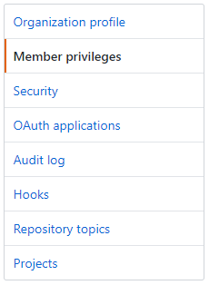
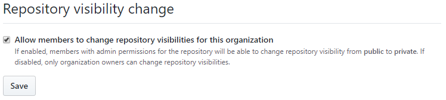
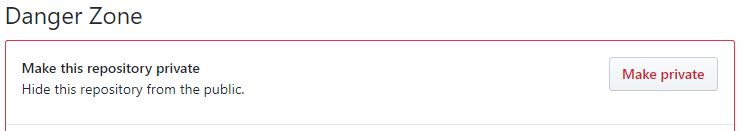
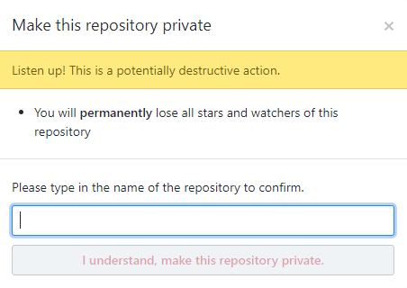

# Public repo to Private repo

### Organization administrators
Individuals that are *Organization owners* are able to modify repository behavior in the Organization.

### Restricting the ability to change the repository type (Public or Private):
* Navigate to the Organization
* Select the **"Settings"** tab
  * 
* Select **"Manage privileges"** from left pane.
  * 
* Locate the **"Repository visibility change"** section
  * 
  * Check the box ("Allow members to...") to allow Repository administrators the ability to change the repository type from Public to Private, or Private to Public.
  * Uncheck the box ("Allow members to...") to not allow Repository administrators the ability to change the repository type (Public / Private).
 

### Repository administrators
Individuals that are 'Repository' owners are able to modify the repository type in the Organization. 
This is true, only if the "Repository visibility change" checkbox is checked in the Organization section above.

### Changing a repository type (Public or Private):
* Navigate to the Repository
  * Select the **"Settings"** tab
  * 
* Scroll down to the **"Danger Zone"**
  * 
  * Click the **"Make private"** button
  * Type the name of the repository to confirm the change and click the **"I understand, make this repository private"** button
  * 
