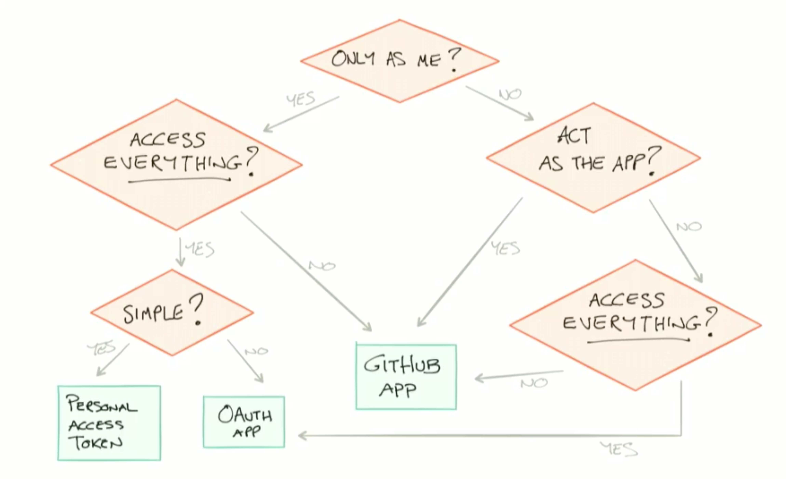

# OAuth Access Methods

## Deciding Which to Use

### Personal Access Tokens (PAT)
You should use a [Personal Access Token](https://docs.github.com/en/enterprise-server@2.22/authentication/keeping-your-account-and-data-secure/creating-a-personal-access-token) in place of your password when interacting with the command line or GitHub API.

You can create multiple PATs, specify permission scopes for each, and revoke them at any time.

Keep these ideas in mind when using personal access tokens:
* Remember to use this token to represent yourself only.
* You can perform one-off cURL requests.
* You can run personal scripts.
* Don't set up a script for your whole team or company to use.
* Don't set up a shared user account to act as a bot user.
* Do set an expiration for your personal access tokens, to help keep your information secure.

## App Access
### GitHub Apps VS OAuth Apps
OAuth Apps act as a GitHub user. GitHub Apps act as itself.

### GitHub Apps
A GitHub App acts on its own behalf, taking actions via the API directly using its own identity, which means you don't need to maintain a bot or service account as a separate user.

GitHub Apps can be installed directly on organizations and user accounts and granted access to specific repositories. They come with built-in webhooks and narrow, specific permissions.

To install a GitHub App, you must be an organization owner or have admin permissions in a repository.

Keep these ideas in mind when creating GitHub Apps:
* Make sure the GitHub App integrates with specific repositories.
* The GitHub App should connect to a personal account or an organization.
* Don't expect the GitHub App to know and do everything a user can.
* Don't use a GitHub App if you just need a "Login with GitHub" service. But a GitHub App can use a [user identification flow](https://docs.github.com/en/enterprise-server@2.22/developers/apps/building-github-apps/identifying-and-authorizing-users-for-github-apps) to log users in and do other things.
* Don't build a GitHub App if you only want to act as a GitHub user and do everything that user can do.

To begin developing GitHub Apps, start with [Creating a GitHub App](https://docs.github.com/en/enterprise-server@2.22/developers/apps/building-github-apps/creating-a-github-app).

### OAuth Apps
OAuth2 is a protocol that lets external applications request authorization to private details in a user's GitHub account without accessing their password.

An OAuth App uses GitHub as an identity provider to authenticate as the user who grants access to the app. This means when a user grants an OAuth App access, they grant permissions to all repositories they have access to in their account, and also to any organizations they belong to that haven't blocked third-party access.

Building an OAuth App is a good option if you are creating more complex processes than a simple script can handle. Note that OAuth Apps are applications that need to be hosted somewhere.

Keep these ideas in mind when creating OAuth Apps:
* An OAuth App should always act as the authenticated GitHub user across all of GitHub (for example, when providing user notifications).
* An OAuth App can be used as an identity provider by enabling a "Login with GitHub" for the authenticated user.
* Don't build an OAuth App if you want your application to act on a single repository. With the repo OAuth scope, OAuth Apps can act on all of the authenticated user's repositories.
* Don't build an OAuth App to act as an application for your team or company. OAuth Apps authenticate as a single user, so if one person creates an OAuth App for a company to use, and then they leave the company, no one else will have access to it.

::: tip For more on OAuth Apps, see 
[Creating an OAuth App](https://docs.github.com/en/enterprise-server@2.22/developers/apps/building-oauth-apps/creating-an-oauth-app) and [Registering your app](https://docs.github.com/en/enterprise-server@2.22/rest/guides/basics-of-authentication#registering-your-app)
:::