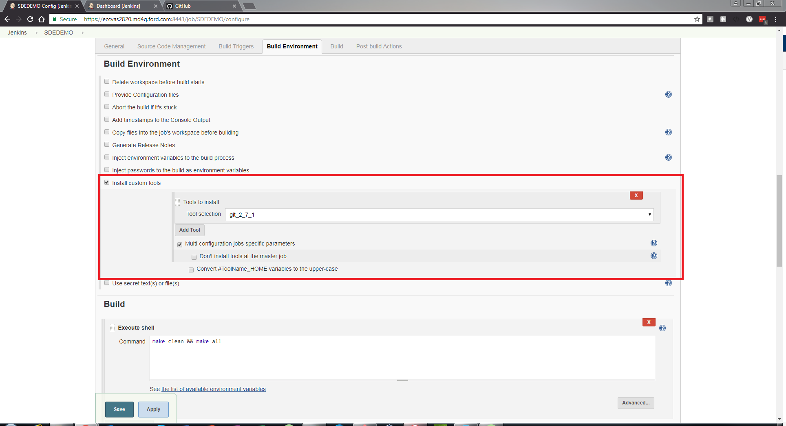

# GitHub to Jenkins Integration    

## Pre-requisites: 
* Jenkins server
* Git Bash 
* Jenkins Job you would like to link 
* Access to a Generic CDSID 
* GitHub account for both yourself and the generic ID
* The generic CDSID account is added to a Jenkins role that has read/write permissions to your Jenkins job 
* GitHub repository that you would like to link 

## Step-by-step guide
1. First, you'll need to install the GitHub Jenkins plugin. If you already installed the GitHub Plugin for Jenkins, then please skip this step.
    * Navigate to your Jenkins instance 
    * Select "Manage Jenkins" from the left-hand menu.
    * 
    * Scroll down to "Manage Plugins" and select it.
    * 
    * Select the "Available" tab
    * 
    * On the top right-hand side, search for "GitHub plugin" 
    * Check the "GitHub plugin" checkbox
    * 
    * Select "Download now and install after restart" at the bottom of the screen 
    * 
2. Second, you'll need to install the Git plugin as well if it is not already installed on your Jenkins instance
    * Navigate to your Jenkins instance 
    * Select "Manage Jenkins" from the left-hand menu 
    * 
    * Scroll down to "Manage Plugins" and select it 
    * 
    * Select the "Available" tab
    * 
    * On the top right-hand side, search for "Git" 
    * Check the "Git" checkbox
    * 
    * Select "Download now and install after restart" at the bottom of the screen 
    * 
3. After successfully installing the Git and GitHub plugins, you'll need to create an SSH Key pair for your Generic CDSID account 
    * Login to a machine using the Generic CDSID's credentials 
    * Once logged in, open Git Bash and execute the following command, taking all the defaults values (not setting a passphrase): `ssh-keygen` 
    * Navigate to your Generic CDSID's GitHub account 
    * Select the account's gravatar's drop-down menu from the top right-hand side of the screen 
    * Select "Settings" 
    * 
    * Select "SSH and GPG keys" from the left-hand menu 
    * 
    * Click the "New SSH Key" button at the top-right side of the screen 
    * 
    * Provide a title for the Key 
    * Navigate back to the Git Bash window and enter the following command: `cat ~/.ssh/id_rsa.pub | clip` 
    * Navigate back to the browser and right-click paste into the Key field 
    * You should end up with a long string of characters that start with ssh-rsa and end with YourId@computername

4. You will also need to create a Personal Access Token for your Generic account 
    * Select the account's gravatar's drop-down menu from the top right-hand side of the screen in GitHub 
    * Select "Settings" 
    * 
    * Select "Personal Access Token" from the left-hand menu 
    * 
    * Click on the "Generate new token" button 
    * 
    * Give your token a name and then provide it with full scope permissions by selecting all of the checkboxes
    * 
    * Select "Generate Token" 
    * 
    * On the following screen, copy and save the token value to a file that you can access later. This is the only time that you will be able to see the token value in GitHub 
    * 
5. Now that you've created the SSH Key pair for your generic account, you'll need to add the SSH Private Key to the Jenkins instance 
    * Navigate back to your Jenkins instance and select "Credentials" from the left-hand side menu 
    * 
    * Select "Jenkins" under "Stores scoped to Jenkins" section 
    * 
    * Select "Global Credentials (unrestricted) 
    * 
    * In the top left-hand side of the screen, select "Add Credentials" 
    * 
    * From the "Kind" drop-down, select "SSH Username with private key" 
    * Keep the "Scope" as "Global" 
    * enter `git` as the username 
    * And select "Enter Directly" from the radio buttons 
    * Past the private key you generated in Step 2 into the field. If you now longer have the key copied to your clipboard, perform the cat command again from Step 2.i 
    * leave the passphrase blank 
    * set the ID to the CDSID of the generic account
    * Click "OK" 
    * 
6. You'll also need to add the Personal Access Token that you created for your Generic account to the Jenkins instance
    * Navigate back to your Jenkins instance and select "Credentials" from the left-hand side menu 
    * 
    * Select "Jenkins" under "Stores scoped to Jenkins" section
    * 
    * Select "Global Credentials (unrestricted)
    * 
    * In the top left-hand side of the screen, select "Add Credentials" 
    * 
    * From the "Kind" drop-down, select "Secret Text" 
    * Keep the "Scope" as "Global" 
    * Access the file you saved the Generic Account's Personal Access Token value to, and copy and paste the value into the "Secret" field 
    * You can leave the ID field blank, as a unique ID will automatically be generated 
    * Description is optional 
    * Click "OK"
    * 
7. After adding the credentials to the instance, you'll need to configure the GitHub plugin to use the credentials as well 
    * Click on "Manage Jenkins" 
    * 
    * Select "Configure System" 
    * 
    * Scroll down to the GitHub plugin and select "Add GitHub Server" 
    * 
    * Enter https://github.ford.com/api/v3 in the API URL field
    * From the "Credentials" drop-down menu, select the Secret Text Jenkins credentials that use the Generic account's Personal Access Token 
    * Check the "Manage Hooks" checkbox 
    * 
    * Select "Test Connection" and ensure that you receive a "Credentials verified for user GenericAccountCDSID, rate limit: xxxxxx" message  
    * 
8. Now the Jenkins job needs to be configured 
    * From the Jenkins Dashboard page, navigate to your Jenkins job 
    * Select "Configure" from the left-hand side menu 
    * 
    * In the "General" tab, check the "GitHub project" checkbox, and enter the http URL of the GitHub repository you would like to integrate 
    * 
    * Select the "Source Code Management" tab 
    * Select the "Git" radio button, and unter the SSH repository URL of the GitHub repository you would like to integrate 
    * From the "Credentials" drop-down menu, select the SSH Jenkins credentials you created for your Generic ID 
    * In the "Branch Specifier" field, you can specify Jenkins to only build Pushes to a single branch, or you can enter "**" to instruct Jenkins to build any Pushes on any branch in the associated GitHub repository 
    * Keep (Auto) selected from the "Repository browser" field 
    * 
    * Select the "Build Triggers" tab, and check the "GitHub hook trigger for GITScm polling" checkbox
    * 
    * Under the "Build Environment" tab, Check the "Install custom tools" checkbox
    * From the "Tool selection" drop-down, select git
    * Check the "Multi-configuration jobs specific parameters" checkbox 
    * 
    * Navigate to the "Post-Build Actions" tab 
    * Click the "Add post-build action" button 
    * 
    * Select "Set GitHub commit status (universal)" 
    * Select "Latest build revision" from the "Commit SHA" drop-down menu 
    * Select "Manually entered repository" from the Repositories drop-down menu
    * Enter the http URL of the GitHub repository you would like to integrate 
    * Select "From GitHub property with fallback to job name" from the "Commit context" drop-down menu 
    * Select "One of default messages and statuses" from the "Status Result" drop-down menu 
    * Select "Backref to the build" from the "Status backref" drop-down menu 
    * 
9. Configure the GitHub repository 
    * Navigate to the GitHub repository you would like to integrate 
    * Select the "Settings" tab
    * Select "Hooks & Services"  from the left-hand side menu 
    * 
    * Under the "Services" section, select "Add service"
    * 
    * Select "Jenkins (GitHub plugin)" from the drop-down menu
    * 
    * Enter your Jenkins' instance URL followed by the github-webhook/ endpoint using the instance's IP and not the FQDN i.e. https://JenkinsURL/github-webhook/ 
    * Select "Add Service" 
    * 
10. Setup Required Status Checks in GitHub repository 
    * From the "Settings" tab of your GitHub repository, select "Branches" on the left-hand side menu
    * Under the "Protected Branches" section, select your desired protected branch from the "Choose a branch" drop-down menu 
    * 
    * On the next screen, select "Protect this branch" 
    * Check the "Require status checks to pass before merging" checkbox 
    * Select "Save Changes" 
    * 

Git Push events will now be sent by GitHub to Jenkins and Jenkins will perform any build scripts you have configured in the job on the contents of the Git Push. The status of the build will be reported back to GitHub, and if you have required that Status Checks pass and the build scripts fail, GitHub will not allow the associated pull request to be merged into the protected branch 